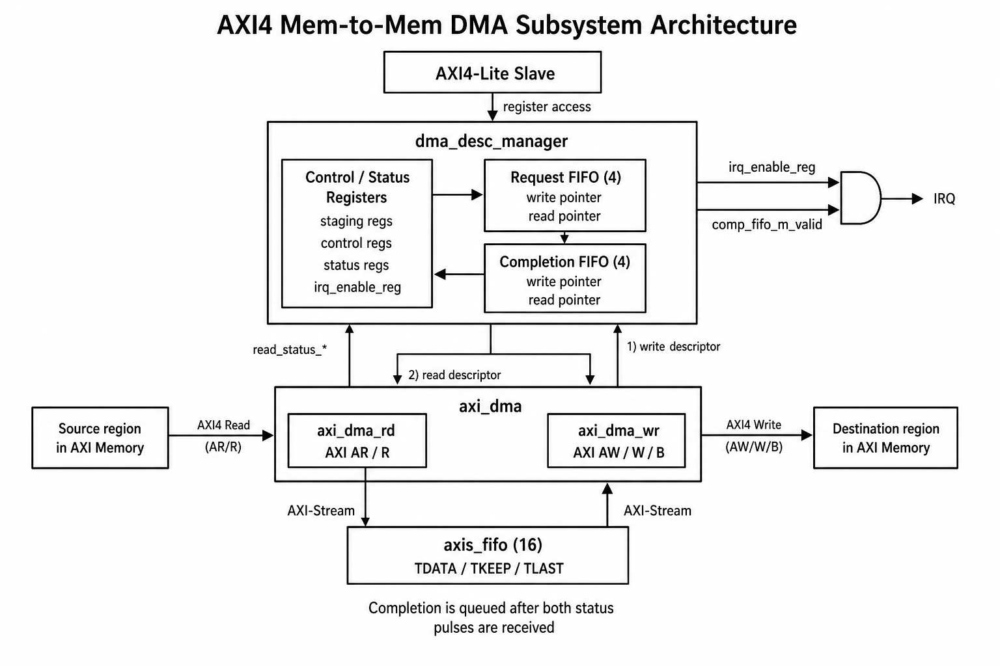
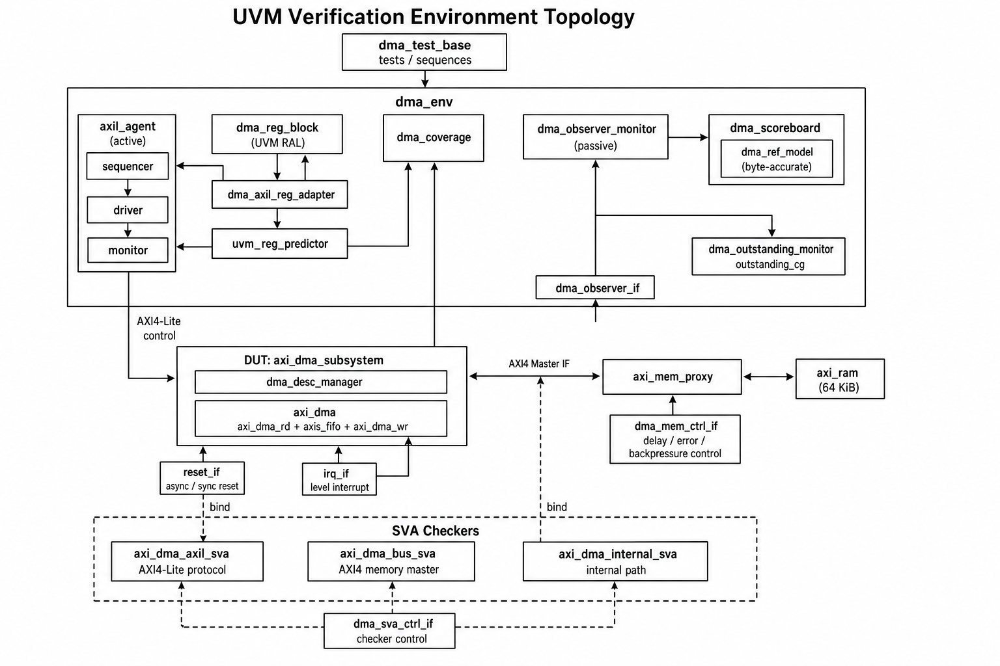
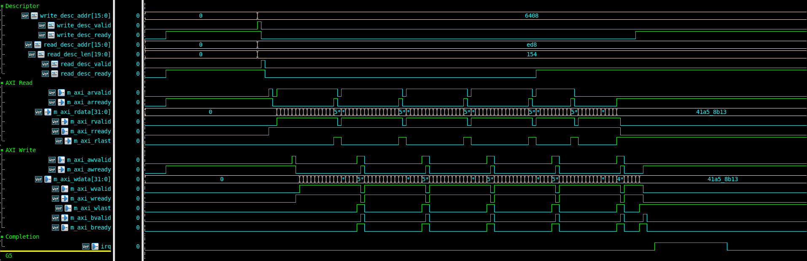
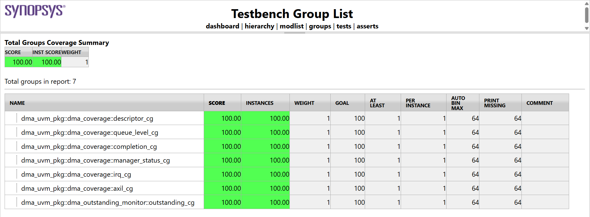
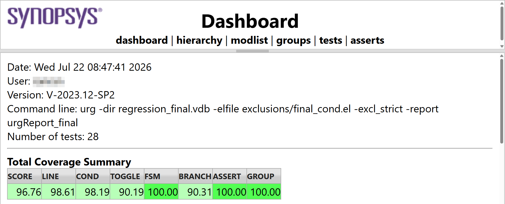

# AXI4 Mem-to-Mem DMA Subsystem Integration and UVM-based Verification


> A multi-descriptor AXI4 memory-to-memory DMA subsystem with an AXI-Lite control plane and a coverage-driven UVM verification environment.

This project integrates a queued descriptor manager with a vendored AXI DMA read/write engine. Software or a verification sequence programs source address, destination address, byte length, and tag through AXI4-Lite. The subsystem then moves data through an internal AXI4-Stream FIFO, records completion status, and raises a level-sensitive interrupt when enabled.

The verification platform includes an active AXI-Lite agent, UVM RAL, a controllable AXI memory proxy, a byte-accurate reference model, an end-to-end scoreboard, functional coverage, SVA, and a 28-test VCS regression.

---

## Project Highlights

- AXI4-Lite controlled AXI4 memory-to-memory data movement
- Queued requests and completions with in-order descriptor execution
- Internal AXI4-Stream FIFO decoupling the read and write engines
- Completion tag, actual length, error/mismatch status, and level-sensitive IRQ
- Descriptor validation for width, alignment, address range, and overlap
- UVM RAL frontdoor access with monitor-driven prediction
- Byte-accurate end-to-end data, burst, and completion checking
- AXI backpressure, error injection, reset recovery, and outstanding-burst scenarios
- Seven functional covergroups, 30 assertions, and 19 cover properties
- Final exclusion-aware URG score of 96.76%

# System Architecture



The subsystem exposes one AXI4 master interface. Source and destination addresses refer to regions in the same external memory address space; the testbench connects that interface to a single 64 KiB AXI RAM through a verification-only proxy.

## Control Path

1. Software writes the descriptor staging registers.
2. A write-one pulse to `SUBMIT` atomically pushes a valid descriptor into the request FIFO.
3. The manager dispatches the write descriptor first, followed by the read descriptor.
4. Descriptors execute in order, one at a time, while later requests may remain queued.
5. The manager waits for both DMA status channels before committing a completion record.
6. Software reads the completion head and writes `COMP_POP` to remove it.

## Data Path

```text
AXI4 memory read
    → axi_dma_rd
    → internal AXI4-Stream
    → axis_fifo
    → axi_dma_wr
    → AXI4 memory write
```

The internal AXI4-Stream path is not exposed at the subsystem boundary.

## Descriptor Acceptance Policy

A submission is rejected before it reaches the request FIFO when any of the following is true:

- Transfer length is zero
- Source address, destination address, length, or tag exceeds its configured width
- Source or destination address is unaligned while `ENABLE_UNALIGNED=0`
- Source or destination range exceeds the configured AXI address space
- Source and destination byte ranges overlap
- The request FIFO cannot accept another entry

Rejected-full and rejected-invalid conditions are recorded in separate sticky status bits.

## Tested Configuration

| Parameter                       | Value            |
| :------------------------------ | :--------------- |
| AXI4-Lite address / data width  | 8 / 32 bits      |
| AXI4 address / data / ID width  | 16 / 32 / 8 bits |
| Maximum AXI burst length        | 16 beats         |
| Descriptor length / tag width   | 20 / 8 bits      |
| Internal AXI4-Stream width      | 32 bits          |
| AXI4-Stream FIFO depth          | 16 entries       |
| Request / completion FIFO depth | 4 / 4 entries    |
| Testbench memory size           | 64 KiB           |
| `ENABLE_UNALIGNED`              | `0`              |
| `ENABLE_SG`                     | `0`              |
| Testbench clock                 | 100 MHz          |


These values describe the checked-in testbench configuration, not universal limits of every parameterized build.

---

# External Interfaces

| Interface    | Direction       | Purpose                                                                     |
| :----------- | :-------------- | :-------------------------------------------------------------------------- |
| `clk`, `rst` | Input           | Single-clock synchronous operation and active-high reset                    |
| `s_axil_*`   | AXI4-Lite slave | Descriptor staging, command, status, queue, and completion registers        |
| `m_axi_*`    | AXI4 master     | Burst reads from the source range and burst writes to the destination range |
| `irq`        | Output          | High while IRQ is enabled and the completion FIFO is non-empty              |

The AXI4 master exposes the standard AW, W, B, AR, and R channels. The AXI4-Lite control port exposes independent AW/W/B and AR/R channels.

---

# Register Map

All registers are 32 bits wide.

| Offset | Register          | Access  | Description                                                      |
| :----- | :---------------- | :------ | :--------------------------------------------------------------- |
| `0x00` | `CONTROL`         | RW / WO | Bit 0: `IRQ_ENABLE`; bit 1: `CLEAR_STICKY` write-one pulse       |
| `0x04` | `STATUS`          | RO      | Active, FIFO state, IRQ, and sticky error indicators             |
| `0x08` | `SRC_ADDR`        | RW      | Staged source byte address                                       |
| `0x0C` | `DST_ADDR`        | RW      | Staged destination byte address                                  |
| `0x10` | `LENGTH`          | RW      | Staged transfer length in bytes                                  |
| `0x14` | `TAG`             | RW      | Staged software tag                                              |
| `0x18` | `SUBMIT`          | WO      | Bit 0 submits the staged descriptor as a write-one pulse         |
| `0x1C` | `COMP_TAG`        | RO      | Tag at the completion FIFO head; zero when empty                 |
| `0x20` | `COMP_LENGTH`     | RO      | Actual write length at the completion FIFO head; zero when empty |
| `0x24` | `COMP_STATUS`     | RO      | Read/write errors and tag/length mismatch flags                  |
| `0x28` | `COMP_POP`        | WO      | Bit 0 removes the completion FIFO head as a write-one pulse      |
| `0x2C` | `QUEUE_LEVELS`    | RO      | Request level in `[15:0]`, completion level in `[31:16]`         |
| `0x30` | `SUBMITTED_COUNT` | RO      | Number of descriptors accepted into the request FIFO             |
| `0x34` | `COMPLETED_COUNT` | RO      | Number of completion records committed                           |

`STATUS` uses bits 0–10 for `ACTIVE`, `REQ_EMPTY`, `REQ_FULL`, `SUBMIT_READY`, `COMP_VALID`, `COMP_FULL`, `IRQ`, `REJECT_FULL_STICKY`, `REJECT_INVALID_STICKY`, `STATUS_MISMATCH_STICKY`, and `POP_EMPTY_STICKY`.

`COMP_STATUS` uses bits `[3:0]` for the read error, `[7:4]` for the write error, and bits 8–10 for read-tag, write-tag, and length mismatch flags.

---

# Verification Architecture



The environment deliberately does not contain a full AXI memory UVM agent or a virtual sequencer. AXI memory behavior is provided by the HDL `axi_mem_proxy` and `axi_ram`, controlled through `dma_mem_ctrl_if`.

## Active AXI-Lite Agent and RAL

The active AXI-Lite agent contains a sequencer, driver, and monitor. Transactions model read/write operation, address, write data, byte strobes, protection attributes, response timing controls, and returned response data.

The UVM register block maps all 14 control and status registers. A custom adapter translates RAL operations into `axil_item` transactions, while the AXI-Lite monitor feeds a `uvm_reg_predictor`. Register-model coverage is disabled; functional coverage is collected separately.

## Memory Proxy and RAM Model

The verification-only AXI proxy sits between the DUT and `axi_ram`. It supports:

- Independent AW, W, B, AR, and R channel stalls
- Address-matched read and write response injection
- AXI `SLVERR` and `DECERR` scenarios
- Queued address requests for multiple outstanding-burst verification
- Fault-hit counters for scenario self-checking

The RAM is initialized with deterministic high-entropy 32-bit words so data movement and toggle activity are repeatable.

## Reference Model and Scoreboard

The reference model is a byte-addressable 64 KiB memory initialized identically to the testbench RAM. At descriptor start, the scoreboard snapshots the expected source bytes, then:

1. Checks AXI AR/AW burst type, beat size, and requested range.
2. Reconstructs each write burst and checks `WLAST` placement.
3. Compares every byte enabled by `WSTRB` against the source snapshot.
4. Updates reference memory with accepted writes for later descriptors.
5. Checks completion tag, length, mismatch flags, and byte counts.
6. Detects unfinished bursts or an active descriptor at end of test.

Directed error-response sequences separately validate the encoded read/write error values. Together, these checks create an end-to-end path from descriptor acceptance to memory write completion.

## Representative Transaction

A representative successful transfer spans descriptor submission, write/read descriptor handshakes, AXI read and write bursts, completion FIFO commit, and IRQ assertion. The companion image guide lists an exact Verdi signal set for capturing this sequence.



---

# Functional Coverage

Seven covergroups are implemented, and all seven report 100% in the supplied final URG report.

| Covergroup          | Main coverage intent                                                                                                            |
| :------------------ | :------------------------------------------------------------------------------------------------------------------------------ |
| `axil_cg`           | Read/write operation, register address, WSTRB class and pattern, individual byte lanes, response, and operation/address crosses |
| `descriptor_cg`     | Length classes, source/destination alignment, source/destination 4 KiB crossing, range overlap, tag classes, and boundary cross |
| `irq_cg`            | IRQ levels and transitions, enable state, completion validity, and legal crosses                                                |
| `manager_status_cg` | Active/FIFO/IRQ states and sticky rejection or empty-pop status                                                                 |
| `queue_level_cg`    | Empty, one, mid, and full occupancy plus request/completion presence cross                                                      |
| `completion_cg`     | Completion tag and length classes, read/write errors, and mismatch status                                                       |
| `outstanding_cg`    | Zero, one, and multiple read/write outstanding bursts plus read/write cross                                                     |

The implementation contains 43 named coverpoints and 7 crosses across these groups.



---

# Assertions

| Checker                | Assertions | Cover properties | Scope                                                                                                       |
| :--------------------- | :--------- | :--------------- | :---------------------------------------------------------------------------------------------------------- |
| `axi_dma_axil_sva`     | 5          | 5                | AXI4-Lite request/response stability under stall                                                            |
| `axi_dma_bus_sva`      | 14         | 6                | AXI4 stability, INCR bursts, full-width beats, 4 KiB rules, known payloads, stalls, and errors              |
| `axi_dma_internal_sva` | 11         | 8                | Descriptor/stream/completion stability, FIFO bounds, counts, IRQ definition, reset, and internal activation |
| **Total**              | **30**     | **19**           | **49/49 assertion-coverage objects reported**                                                               |

The final report records all 30 assertions as successful and all 19 cover properties as matched.

---

# Regression Test Matrix

The checked-in regression script and final URG report contain the same 28 concrete tests. Three reusable sequence bases support 25 concrete scenario sequences; the four error-response tests share one parameterized sequence.

## Basic Data Movement

| Test                    | Primary sequence       | Purpose                                                                                   |
| :---------------------- | :--------------------- | :---------------------------------------------------------------------------------------- |
| `dma_random_smoke_test` | `dma_random_smoke_seq` | One constrained-random aligned, non-overlapping transfer with count and completion checks |
| `dma_ral_smoke_test`    | `dma_ral_smoke_seq`    | Basic transfer programmed entirely through the RAL frontdoor                              |

## AXI-Lite and Register Policy

| Test                             | Primary sequence                | Purpose                                                                 |
| :------------------------------- | :------------------------------ | :---------------------------------------------------------------------- |
| `dma_wstrb_test`                 | `dma_wstrb_seq`                 | All 16 WSTRB patterns across the four descriptor staging registers      |
| `dma_access_policy_test`         | `dma_access_policy_seq`         | Write-only reads and benign writes to protected status space            |
| `dma_ro_write_protection_test`   | `dma_ro_write_protection_seq`   | Writes to all seven read-only registers leave values unchanged          |
| `dma_command_noop_test`          | `dma_command_noop_seq`          | Zero-strobe and zero-data command writes do not generate command pulses |
| `dma_empty_completion_read_test` | `dma_empty_completion_read_seq` | Empty completion-head registers return zero                             |

## Descriptor, Length, and Boundary Policy

| Test                            | Primary sequence               | Purpose                                                                                    |
| :------------------------------ | :----------------------------- | :----------------------------------------------------------------------------------------- |
| `dma_boundary_matrix_test`      | `dma_boundary_matrix_seq`      | Neither/source/destination/both-side 4 KiB crossing combinations                           |
| `dma_length_sweep_test`         | `dma_length_sweep_seq`         | Deterministic lengths of 4, 32, 128, 512, 4096, and 8192 bytes                             |
| `dma_sub_beat_tag_test`         | `dma_sub_beat_tag_seq`         | Legal 1/2/3-byte transfers with zero and high tag values                                   |
| `dma_invalid_desc_test`         | `dma_invalid_desc_seq`         | Zero length, unaligned source, and over-width tag rejection                                |
| `dma_alignment_reject_test`     | `dma_alignment_reject_seq`     | All nonzero source/destination byte offsets rejected in the tested configuration           |
| `dma_address_range_reject_test` | `dma_address_range_reject_seq` | Over-width source, destination, and length rejection                                       |
| `dma_overlap_reject_test`       | `dma_overlap_reject_seq`       | Both overlap directions, identical ranges, wraparound rejection, and adjacent legal ranges |

## IRQ and Queue Behavior

| Test                        | Primary sequence           | Purpose                                                                          |
| :-------------------------- | :------------------------- | :------------------------------------------------------------------------------- |
| `dma_irq_mode_test`         | `dma_irq_mode_seq`         | Completion behavior with IRQ disabled and enabled                                |
| `dma_queue_saturation_test` | `dma_queue_saturation_seq` | Four-entry request/completion FIFO saturation, rejection, and drainage           |
| `dma_pop_empty_test`        | `dma_pop_empty_seq`        | Empty completion pop sticky status and clear behavior                            |
| `dma_queue_mid_level_test`  | `dma_queue_mid_level_seq`  | Deterministic request FIFO mid-level observation followed by completion drainage |

## AXI Faults and Resilience

| Test                        | Primary sequence           | Purpose                                                               |
| :-------------------------- | :------------------------- | :-------------------------------------------------------------------- |
| `dma_read_slverr_test`      | `dma_error_response_seq`   | Address-matched read `SLVERR` injection and completion encoding       |
| `dma_read_decerr_test`      | `dma_error_response_seq`   | Address-matched read `DECERR` injection and completion encoding       |
| `dma_write_slverr_test`     | `dma_error_response_seq`   | Address-matched write `SLVERR` injection and completion encoding      |
| `dma_write_decerr_test`     | `dma_error_response_seq`   | Address-matched write `DECERR` injection and completion encoding      |
| `dma_axi_backpressure_test` | `dma_axi_backpressure_seq` | Independent AW/W/B/AR/R stalls followed by forward progress           |
| `dma_outstanding_test`      | `dma_outstanding_seq`      | Multiple accepted, incomplete read and write bursts                   |
| `dma_reset_recovery_test`   | `dma_reset_recovery_seq`   | Reset during an active transfer followed by a clean transfer recovery |

## Coverage-Closure Scenarios

| Test                           | Primary sequence              | Purpose                                                                                                      |
| :----------------------------- | :---------------------------- | :----------------------------------------------------------------------------------------------------------- |
| `dma_toggle_stress_test`       | `dma_toggle_stress_seq`       | Eight diverse address, length, and tag combinations for meaningful toggles                                   |
| `dma_write_engine_corner_test` | `dma_write_engine_corner_seq` | Partial beats, 4 KiB split, long transfer, and simulation-only white-box write-engine recovery activation    |
| `dma_sva_activation_test`      | `dma_sva_activation_seq`      | Directed stalls, PROT toggles, reset arcs, and limited white-box descriptor-ready forcing for SVA activation |

The two white-box closure tests are explicitly separated from normal black-box functional scenarios.

---

# Implementation Boundary

Project-specific RTL is kept at the top of `rtl/`: `axi_dma_subsystem.v`, `dma_desc_manager.v`, `desc_fifo.v`, and `axis_fifo.v`. The AXI DMA engines and AXI-Lite register-interface helpers are isolated under `rtl/vendor/verilog_axi/` and retain their source-file notices.

The UVM environment, memory proxy, reference model, scoreboard, coverage, SVA, tests, and simulation scripts are maintained separately under `tb/` and `sim/`. The archive does not record a vendored upstream revision, so no specific upstream commit is claimed here.

---

# Directory Structure

```text
.
├── rtl/
│   ├── axi_dma_subsystem.v        Subsystem top level
│   ├── dma_desc_manager.v         Registers, queues, validation, and control FSM
│   ├── desc_fifo.v                Request/completion FIFO primitive
│   ├── axis_fifo.v                Internal AXI4-Stream data FIFO
│   └── vendor/verilog_axi/        Vendored AXI DMA and AXI-Lite register-interface RTL
├── tb/
│   ├── models/
│   │   ├── axi_mem_proxy.sv       Backpressure, errors, and outstanding-burst controls
│   │   └── axi_ram.v              AXI memory model
│   ├── sva/axi_dma_sva.sv         AXI-Lite, AXI4, and internal SVA checkers
│   ├── uvm/
│   │   ├── agents/                Active AXI-Lite agent and passive observers
│   │   ├── env/                   Environment, scoreboard, and coverage
│   │   ├── interfaces/            Six testbench interfaces
│   │   ├── ral/                   Register model and AXI-Lite adapter
│   │   ├── ref_model/             Byte-addressable reference memory
│   │   ├── sequences/             Three bases and 25 scenario sequences
│   │   ├── tests/                 Concrete UVM test classes
│   │   └── transactions/          AXI-Lite and observed-event items
│   └── tb_uvm_top.sv              DUT, proxy, RAM, interfaces, and UVM launch
├── sim/
│   ├── run.sh                     Single-test VCS/URG flow
│   ├── run_regression.sh          28-test merged-coverage regression
│   ├── run_uvm.f                  Compile file list
│   ├── cm_hier_final.cfg          Final code/toggle coverage hierarchy and exclusions
│   ├── cm_assert_hier.cfg         Assertion hierarchy selection
│   └── exclusions/final_cond.el   Strict condition exclusion file
└── urgReport_final/               Supplied final static URG HTML report
```

---

# Running the Verification

## Requirements

- Linux or another environment capable of running the supplied Bash scripts
- Synopsys VCS with UVM 1.2 support
- Synopsys URG for merged coverage reporting
- Verdi is optional for KDB debug and manually enabled waveform analysis

## Run One Test

```bash
cd sim
chmod +x run.sh run_regression.sh
TEST=dma_random_smoke_test SEED=1234 ./run.sh
```

If `TEST` is omitted, `run.sh` defaults to `dma_sva_activation_test`. If `SEED` is omitted, VCS automatic seeding is used.

## Run the 28-Test Regression

```bash
cd sim
BASE_SEED=1000 ./run_regression.sh
```

The regression compiles once, assigns incrementing seeds, writes one log per test under `sim/regression_logs/`, merges coverage into a timestamped VDB, and generates a timestamped URG report.

Optional output overrides:

```bash
BASE_SEED=2000 \
COV_DIR=regression_custom.vdb \
REPORT_DIR=urgReport_custom \
./run_regression.sh
```

Both scripts load `exclusions/final_cond.el` with `-excl_strict` when the file is present and non-empty.

---

# Verification Results

The supplied final report was generated by URG `V-2023.12-SP2` from 28 test contributions; the simulation flow itself uses VCS.

| Metric                              | Final result |
| :---------------------------------- | :----------- |
| Overall URG score                   | **96.76%**   |
| Line coverage                       | **98.61%**   |
| Condition coverage                  | **98.19%**   |
| Toggle coverage                     | **90.19%**   |
| FSM coverage                        | **100.00%**  |
| Branch coverage                     | **90.31%**   |
| Assertion coverage                  | **100.00%**  |
| Functional covergroup coverage      | **100.00%**  |
| Tests contributing to merged report | **28**       |



These are exclusion-aware sign-off values. The scored DUT hierarchy and structural line/toggle exclusions are applied at compile time through `sim/cm_hier_final.cfg`; condition exclusions are applied through `sim/exclusions/final_cond.el` with strict checking. The 96.76% value is the overall URG score, not a test pass rate and not a standalone code-coverage percentage.

The archive contains the final static HTML report, including `dashboard.html`, `tests.html`, `groups.html`, and `asserts.html`. It does not contain the merged VDB or per-test regression logs; preserve those artifacts separately when independent pass/fail auditability is required.

---

# Scope and Limitations

- Scatter-gather mode is disabled and not implemented by the selected vendored DMA configuration.
- Unaligned addresses are disabled in the checked-in configuration; aligned sub-beat lengths remain supported.
- Overlapping source and destination ranges are rejected instead of providing `memmove` semantics.
- The manager queues multiple requests but executes one descriptor at a time.
- The testbench uses one shared AXI address space, not separate source and destination RAMs.
- AXI memory stimulus is provided by an HDL proxy/RAM, not a full AXI UVM agent or commercial VIP.
- Optional FSDB code exists under an `FSDB` compile macro, but the supplied scripts do not enable it by default.

---

# License

This project is open‑source and licensed under the MIT License.
