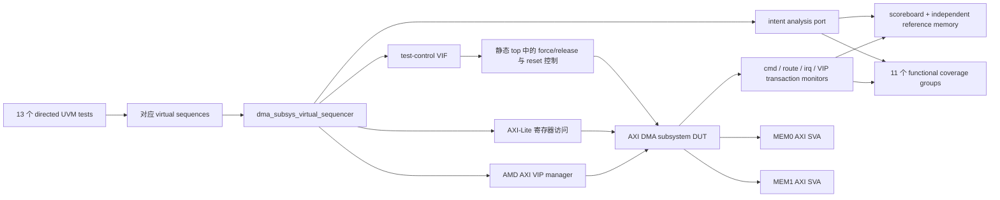

# AXI DMA Subsystem 定向用例与 AXI SVA 实施报告

## 1. 本次交付范围

本次在已有 6 个测试的基础上新增 13 个定向 UVM test，以及与之对应的 13 个 virtual sequence。默认执行：

```bash
./run_vcs_core_amd_vip.sh
```

脚本会依次运行维护表中的 19 个测试，并将各测试写入同一个 regression VDB，最后生成一份累计 URG 报告。单独调试某个测试时仍可使用：

```bash
./run_vcs_core_amd_vip.sh +UVM_TESTNAME=dma_subsys_descriptor_error_test
```

本次还新增：

- `dma_subsys_test_ctrl_if`：仅用于负向场景、运行中 reset 和精确握手控制。
- `dma_subsys_axi_sva`：在 MEM0、MEM1 两个 memory-side AXI4 端口各实例化一次。
- scoreboard 对 `expect_accept=0` 的正式支持：预期被软件控制层拒绝的请求仍采样 intent coverage，但不会留下无法匹配的 pending intent。
- `command_cg.cp_length.zero` 从 illegal bin 改为普通 bin。该命令会先经 `cmd_valid/cmd_ready` 被 manager 接受，再由 descriptor validator 返回 `DMA_ERR_LEN_ZERO`，所以它不是 command monitor 层面的非法采样。

## 2. 结构关系



## 3. 新增定向用例

下文中的“预期覆盖”表示该测试设计上会产生相应采样。是否实际命中必须以 Linux/VCS 回归生成的 URG `groups` 页面为准。

### 3.1 `dma_subsys_ch1_to_ch0_test`

场景：EXT1 先在 RAM1 的 `0x1000_1400` 附近写入 96 字节，软件配置 DMA CH1，从 RAM1 读取并通过 route 0 交给写通道 CH0，最后写入 RAM0 的 `0x0000_2400` 附近。

作用：补齐与已有 CH0→CH1 相反的端到端方向，确认 channel owner、route destination、memory target 和 IRQ/完成归属没有被写死。

预期覆盖：

- `command_cg.cross_route`: `ch1 -> ch0`
- `intent_cg.cross_route`: `ch1 -> ch0`
- `command_cg.cp_length`: `one_burst` 或 `multi_burst` 对应区间
- `route_cg.cross_path`: CH1→CH0 的 request/granted/released
- `completion_cg.cp_owner.ch1`
- `memory_cg`: DMA1 read RAM1、DMA0 write RAM0

### 3.2 `dma_subsys_crossbar_path_matrix_test`

场景分两部分：

1. EXT0、EXT1 分别对 RAM0、RAM1 执行读写，共覆盖 2×2×2 个外部访问组合。
2. 执行 CH0→CH0、CH0→CH1、CH1→CH0、CH1→CH1 四条 DMA 路由，并有意交叉选择源/目的 RAM，使 DMA0、DMA1 均能在回归中对 RAM0、RAM1 产生 read 和 write。

作用：验证 crossbar 的连接矩阵、地址译码和 ID 携带没有遗漏某个 master/target/access 组合。

预期覆盖：

- `memory_cg.cross_path`: 四个 master × 两个 RAM × read/write 的全部合法组合
- `command_cg.cross_route`: 四种 source/destination channel 组合
- `intent_cg.cross_route`: 四种组合
- `route_cg.cross_path`: 四条路径的 request/granted/released
- `memory_cg.cp_response.okay`

### 3.3 `dma_subsys_transfer_length_boundary_test`

场景：依次搬运 1、2、3、4、5、16、17、64、65、256、1024 字节；通道与目标路由交替变化，地址保持 4 字节对齐且源/目的不重叠。

作用：覆盖末拍 `tkeep/WSTRB`、单拍、burst 切分边界以及多 burst 长传输，检查完成长度必须等于软件编程长度。

预期覆盖：

- `command_cg.cp_length` 和 `intent_cg.cp_length`:
  - `sub_beat`
  - `one_beat`
  - `short`
  - `one_burst`
  - `multi_burst`
  - `large_transfer`
- `memory_protocol_cg.cp_beat_count`: single、short、`_medium`、dma_max_window
- `memory_protocol_cg.cp_write_strobe.partial/full`
- `completion_cg.cp_error.success`

### 3.4 `dma_subsys_register_access_policy_test`

场景：读取 CH0、CH1 和 global block 的全部已定义寄存器；执行正常 RW/WO 写、RO 写尝试、WO 读尝试、block 内未映射 offset 访问以及整个 AXI-Lite block 未映射访问。同时通过 test-control VIF 产生 full、partial、zero 三种 WSTRB。

作用：验证寄存器访问权限、错误响应、地址译码和 byte enable 行为。

预期覆盖：

- `register_cg.cp_register`: CH0、CH1、global 的全部显式 register bins
- `register_cg.cp_block`: CH0、CH1、GLOBAL、UNMAPPED
- `register_cg.cp_access_kind`: RW_READ、RW_WRITE、RO_READ、RO_WRITE_ATTEMPT、WO_READ_ATTEMPT、WO_WRITE、UNMAPPED_READ、UNMAPPED_WRITE
- `register_cg.cp_strb`: none、partial、full
- `register_cg.cp_response`: okay、slverr、decerr
- `register_cg.cross_access_response`: read/write 与三类 response 的组合

### 3.5 `dma_subsys_axi_burst_shape_test`

场景：通过 EXT0/EXT1 AMD AXI VIP 发送 FIXED、INCR、WRAP；1/2/4 bytes per beat；ID=0 与非 0；1、2、4、8、16、256 beats；页起点、页内、4 KiB 边界窗口；对齐和非对齐起始地址。另执行一次 AXI 合法的全零 WSTRB 写。

作用：不是只验证 DMA 默认产生的 16-beat INCR，而是覆盖 crossbar 面向完整 AXI4 合法传输形状的能力。

预期覆盖：

- `memory_protocol_cg.cp_burst`: fixed、incr、wrap
- `memory_protocol_cg.cross_burst_access`: 三种 burst × read/write
- `cp_beat_count`: single、short、`_medium`、dma_max_window、extended_incr
- `cp_fixed_length`: single、multi
- `cp_wrap_length`: two、four、eight、sixteen
- `cp_bytes_per_beat`: byte_1、byte_2、byte_4
- `cp_original_id`: zero、nonzero
- `cp_page_offset`: page_start、body、boundary_window
- `cp_start_alignment`: true、false
- `cp_incr_4k_rule.stays_in_page`
- `cp_write_strobe`: none、partial、full
- `cp_protocol_error.clean`

### 3.6 `dma_subsys_route_contention_test`

场景：CH0 先占有 destination route 0 并搬运长数据，CH1 随后请求同一 destination，形成真实 long wait；待 owner 释放后 CH1 完成。第二段通过 test-control 将 `route_req_ready[0]` 精确压低两个周期，形成 short wait。

作用：检查 route 只有一个 owner、请求能等待、释放后 waiter 能继续、不会泄漏 route ownership。

预期覆盖：

- `route_cg.cp_wait.long_wait`
- `route_cg.cp_wait.short_wait`
- 原有无竞争测试提供 `cp_wait.immediate`
- `route_cg.cp_event`: request、granted、released
- destination contention 下的 completion success 和 route release

### 3.7 `dma_subsys_completion_order_reverse_test`

场景：先发 CH1 长传输并给 MEM1 配置固定响应延迟，再发 CH0 单拍传输；预期后发 CH0 先完成。它与已有“先发 CH0、CH1 反超”的测试方向相反。

作用：证明 completion 是按独立 channel 的实际完成顺序上报，而不是按软件 issue 顺序硬串行化。

预期覆盖：

- `completion_order_cg.cp_order_case.ch1_first_ch0_overtakes`
- 随后 CH1 完成时覆盖 `ch1_first_ch1_completes`
- `cp_reordered.out_of_issue_order` 与 `in_issue_order`
- `cp_pending_depth.concurrent`

### 3.8 `dma_subsys_irq_mask_multi_pending_test`

场景：先遍历 none/CH0/CH1/both 的 done 和 error enable 形状；在全部 mask 时制造两个 done pending、两个 error pending 和一个 manager fault pending；确认 IRQ 不错误拉高，再逐步解除 mask，最终同时使 error+fault 成为 enabled causes，最后清除所有 pending。

作用：验证 pending 与 enable 解耦、masked pending 不丢失、多个 cause 合并、per-channel IRQ 与 global IRQ 一致。

预期覆盖：

- `irq_cg.cp_done_enable`、`cp_error_enable`: none/ch0/ch1/both
- `cp_done_pending`、`cp_error_pending`: none/ch0/ch1/both
- `cp_fault_pending`、`cp_fault_enable`: 0/1
- `cp_enabled_cause`: none、done_only、error_only、fault_only、multiple
- `cp_masked_pending`: 0/1
- `cp_channel`: none/ch0/ch1/both
- consistency coverpoints 只应命中 `consistent`

### 3.9 `dma_subsys_descriptor_error_test`

场景包含：

- length=0
- source address 未对齐
- destination address 未对齐
- source range 越过 RAM 末端
- destination range 越过 RAM 末端
- 源/目的区间 overlap
- channel disabled 时 start
- channel busy 时重复 start

作用：覆盖 software control rejection 与 manager descriptor validation 两层不同的错误路径。

预期覆盖：

- `intent_cg.cp_error`: disabled、busy、length_zero、source_alignment、destination_alignment、source_range、destination_range、overlap
- `intent_cg.cp_expect_accept`: 0/1
- `intent_cg.cp_expect_completion`: 0/1
- `command_cg.cp_length.zero` 以及其他长度区间
- `completion_cg.cp_error`: length_zero、source_alignment、destination_alignment、source_range、destination_range、overlap
- `irq_cg.cp_error_pending`

注意：disabled/busy 不进入 manager handshake，因此没有 completion；它们由寄存器状态检查，并作为 `expect_accept=0` intent 采样。

### 3.10 `dma_subsys_abort_timing_test`

场景一：descriptor 已送入 DMA engine 后发 abort，设计按规格完成当前传输并报告 `ABORT_INFLIGHT_UNSUPPORTED`。场景二：CH1 因 route contention 停在 WAIT_ROUTE 时发 abort，报告 `ABORT_PENDING`；CH0 owner 仍正常完成。

作用：区分可在 descriptor 发出前结束的 abort 与无法撤回的 in-flight abort。

预期覆盖：

- `intent_cg.cp_error.abort_pending/abort_inflight`
- `completion_cg.cp_error.abort_pending/abort_inflight`
- `completion_cg.cp_aborted`: 0/1
- `completion_cg.cross_owner_abort`: CH0 aborted、CH1 aborted
- route wait/release 与 error IRQ

### 3.11 `dma_subsys_reset_recovery_test`

场景：先在 idle 状态执行一次 20-cycle reset；再启动长 DMA，在 busy/route active 时执行 20-cycle reset；检查 busy、route matrix、IRQ 全部恢复空闲；最后重新配置并完成 CH1→CH0 搬运。

作用：验证 reset 不只在开机生效，还能清理运行中的 command/route/completion/IRQ 状态，并支持 reset 后重新工作。

预期覆盖：

- `reset_cg.cp_epoch.repeated_reset`
- `reset_cg.cp_assert_context.idle/active`
- `reset_cg.cp_event`: asserted/deasserted
- reset 后新的正常 intent、command、route、completion、IRQ

### 3.12 `dma_subsys_memory_response_error_test`

场景：分别在正确的 memory-side 端口注入 RRESP=SLVERR、RRESP=DECERR、BRESP=SLVERR、BRESP=DECERR，共四条 DMA。响应注入在 source initialization 完成后开启，在对应 completion 后立即关闭。

作用：验证 AXI memory response 到 vendor DMA status，再到 subsystem completion/error/IRQ 的完整错误传播链。

预期覆盖：

- `memory_cg.cp_response`: slverr、decerr
- `memory_cg.cross_access_response`: read×slverr、read×decerr、write×slverr、write×decerr
- `intent_cg.cp_error`: read_slverr、read_decerr、write_slverr、write_decerr
- `completion_cg.cp_error`: 同上四项
- `irq_cg.cp_error_pending`

### 3.13 `dma_subsys_status_fault_injection_test`

场景包含：

- 在自然出现的 read status 周期替换 tag，得到 `TAG_MISMATCH`
- 在自然出现的 write status 周期替换 completed length，得到 `LEN_MISMATCH`
- 在 manager validation 周期替换已捕获的 source channel，得到 completion `ROUTE_CONFLICT`
- 注入非法 manager FSM state，得到 MANAGER/INTERNAL fault 和 INTERNAL completion
- manager idle 时分别注入 RD0、RD1、WR0、WR1 unexpected status
- 替换 route request source，得到 ROUTE/ROUTE_CONFLICT fault；观察后用 reset 终止故意卡住的 flow

作用：覆盖软件正常编程无法到达、但 RTL 为防御硬件异常而实现的状态一致性与 fault 分支。

预期覆盖：

- `intent_cg.cp_error`: tag_mismatch、length_mismatch、route_conflict、unexpected_status、internal
- `completion_cg.cp_error`: tag_mismatch、length_mismatch、route_conflict、internal
- `fault_cg.cp_error`: unexpected_status、route_conflict、internal
- `fault_cg.cp_source`: RD0、RD1、WR0、WR1、ROUTE、MANAGER
- `fault_cg.cp_enabled`: 0/1
- active reset 路径也会再次被采样

## 4. Test-control VIF 的边界

`dma_subsys_test_ctrl_if` 不属于 DUT，也不替代 AMD VIP。它只解决以下“正常软件/API 无法制造”的场景：

- 运行中 reset
- memory-side BRESP/RRESP 错误
- AXI/AXI-Lite 精确 WSTRB
- status tag/length 错误
- idle unexpected status
- route source、route READY 和 manager state 防御分支

所有 UVM class 只访问 virtual interface；`dut.xxx` 层次路径和 `force/release` 全部留在静态 top 中。因此 package 内没有 hierarchical reference，也不会再次出现 package-to-module 层次引用编译错误。每个 force 都有显式 enable 和 release，接口初始值全部关闭。

这些场景应在面试或评审中明确称为“test-only fault injection”，不能描述成软件可配置功能。

## 5. 新增 AXI SVA

SVA 文件在两个 memory-side AXI4 端口各实例化一次。AMD AXI VIP 仍是完整协议 checker；项目 SVA 的价值是让关键规则由仓库自身表达，并进入 assertion coverage。

### 5.1 Reset

- `a_reset_clears_requests`：reset 后 AWVALID、WVALID、ARVALID 必须为 0，防止复位期间残留请求。

### 5.2 VALID 被 backpressure 时 payload 稳定

- `a_aw_payload_stable`：AWVALID=1 且 AWREADY=0 时，AWID/AWADDR/AWLEN/AWSIZE/AWBURST 及 VALID 必须保持。
- `a_w_payload_stable`：WVALID=1 且 WREADY=0 时，WDATA/WSTRB/WLAST 及 VALID 必须保持。
- `a_ar_payload_stable`：ARVALID=1 且 ARREADY=0 时，AR payload 必须保持。
- `a_b_payload_stable`：BVALID=1 且 BREADY=0 时，BID/BRESP 及 VALID 必须保持。
- `a_r_payload_stable`：RVALID=1 且 RREADY=0 时，RID/RDATA/RRESP/RLAST 及 VALID 必须保持。

作用：落实 AXI 最核心的“VALID 不能依赖 READY，握手前 payload 不得变化”规则。

### 5.3 X/Z 检查

- `a_aw_known_when_valid`
- `a_w_known_when_valid`
- `a_ar_known_when_valid`
- `a_b_known_when_valid`
- `a_r_known_when_valid`

作用：当某通道 VALID 为 1 时，payload 和对应 READY 不允许包含 X/Z，避免 X optimism 让 scoreboard 假通过。

### 5.4 Burst 参数合法性

- `a_aw_size_legal`、`a_ar_size_legal`：SIZE 不得超过 32-bit data bus 所支持的 4 bytes/beat。
- `a_aw_burst_not_reserved`、`a_ar_burst_not_reserved`：BURST=2'b11 为保留编码。
- `a_aw_fixed_length`、`a_ar_fixed_length`：FIXED burst 不超过 16 beats。
- `a_aw_wrap_length`、`a_ar_wrap_length`：WRAP 只允许 2、4、8、16 beats，即 LEN=1、3、7、15。
- `a_aw_incr_4k_boundary`、`a_ar_incr_4k_boundary`：完成握手的 INCR burst 不得跨越 4 KiB 边界。

### 5.5 Assertion cover properties

- `c_aw_backpressure`
- `c_w_backpressure`
- `c_ar_backpressure`
- `c_fixed_burst`
- `c_wrap_burst`

作用：assertion 没失败只能说明“没看到违规”；cover property 进一步证明回归实际产生过 backpressure、FIXED 和 WRAP 场景。

## 6. 预期的覆盖率收敛检查顺序

1. 先单独运行 13 个新测试，确认每个日志均为 `UVM_ERROR : 0`、`UVM_FATAL : 0`，并检查没有 SVA failure。
2. 运行默认 19-test regression，生成累计 VDB 和 URG。
3. 在 `groups` 页面按以下顺序查看：intent → command → register → memory → memory_protocol → route → completion → completion_order → irq → fault → reset。
4. 对未命中的 bin 回看对应 test 日志中的 `SCB_SUMMARY`、`COV_SUMMARY` 和事务打印，先判断是激励未产生、monitor 未归一化，还是 bin 定义不可达。
5. 只有证明规格不可达或不适用的 bin 才进入 exclusion；不要为了数字直接豁免可验证功能。

## 7. 验证状态与运行注意事项

- Windows 侧已完成静态 SystemVerilog 语法解析，新增 interface、SVA、sequence、test 和 top 修改均为 0 个语法诊断。
- 根据权限边界，本次没有进入或运行用户虚拟机，因此尚不能声称 VCS 仿真及实际 bin 命中已经通过。
- 所有新增/修改的 `.sv`、`.svh`、`.f`、`.sh` 文件应保持 LF；复制到 Linux 后可用 `file` 或 `dos2unix -ih` 复核。
- fault injection test 必须逐个先跑。若 vendor VIP 对被强制的 response/status 有版本相关行为，应保留 VDB 和该 test 的完整日志，再按实际 API/时序微调注入窗口，不应放宽 scoreboard。

## 8. 协议参考

- Arm AMBA AXI and ACE Protocol Specification：<https://developer.arm.com/documentation/ihi0022/latest/>
- AMD AXI VIP Product Guide (PG267)：<https://docs.amd.com/r/en-US/pg267-axi-vip/AXI-Verification-IP-v1.1-Product-Guide>

